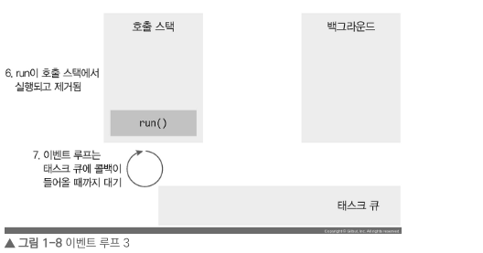
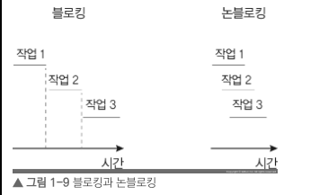

## Node 시작하기

### 1.1 핵심 개념 이해하기

- 노드에 대해 이해하기 위해선 노드 공식 사이트(https://nodejs.org/ko/)에서 노드를 다음과 같이 설명하고 있다.
- Node.js는 Chrome V8 Javascript 엔진으로 빌드된 자바스크립트 런타임이다.

- 서버와 런타임이 무엇인지 확인해보자.

#### 1.1.1 서버

- 노드는 서버 애플리케이션을 실행하는데 제일 많이 사용한다.

- 서버란, 네트워크를 통해 클라이언트에 정보나 서비스르 제공하는 컴퓨터 또는 프로그램을 말한다.
- 클라이언트란 요청을 보내는 주체로 브라우저일 수도 있고, 데스콥 프로그램일수도 있고, 모바일 앱일수도 있고, 다른 서버에 요청을 보내는 서버일 수도 있다.

- 웹사이트의 화면(HTML), 앱 설치 파일은 어디에서 가져오는 지 생각해보자.

- 주소창에 입력(요청) -> 브라우저는 주소에 해당하는 컴퓨터 위치 파악 -> 웹 사이트 페이지를 받아와 요청자의 클라이언트(브라우저)에 띄운다 (응답) -> 서버가 하는 일

- 모바일 앱 설치 -> 설치 버튼(요청) -> 내려받기 (응답) -> 데이터를 받아와 모바일 기기에 설치할 수 있다.
- 어딘가가 구글 or 애플 서버이다. 플레이스토어, 앱스토어가 클라이언트 역할

- 데이터를 어딘가에 저장, 어디간에서 클라이언트로 데이터를 받아와야 하는것이 서버이다.

- 즉, 서버는 클라이언트의 요청에 응답을 한다. 응답으로 항상 Yes가 아닌 No를 할 수도 있다.
- 어떤 사이트로부터 차단을 당하면 사이트의 서버는 내 요청에 매번 No를 응답한다.

- 노드는 자바스크립트 프로그램이 서버로 기능하기 위해 도구를 제공, 서버 역할을 수행할 수 있다.
- 노드의 특성에 대해 알아보자.

#### 1.1.2 자바스크립트 런타임

- Node.js는 CHROME v8 jAVASCRIPT 엔진으로 빌드된 자바스크립트 런타임이다.
- 노드는 자바스크립트 런타임이다. 런타임은 특정 언어로 만든 프로그램들을 실행할 수 있는 환경을 뜻한다.
- 노드는 자바스크립트 프로그램을 컴퓨터에서 실행할 수 있다.

- 기존에는 자바스크립트는 웹 브라우저 위에서만 실행할 수 있었다.
- 하지만 2008년 구글이 V8 엔진을 사용해 크롬을 출시할 때부터 달라졌다.
- 다른 엔진과 달리 매우 빨랐고, 오픈 소스로 코드를 공개했다.


- 노드는 V8과 더불어 libuy라는 라이브러리를 사용한다.
- 노드의 특성인 이벤트 기반, 논블로킹 I/O 모델을 구현하고 있다. 장단 점을 알아보자

> **Note | 노드 외의 런타임**
> 자바스크립트 런타임은 노드 외에도 많다. 노드의 유명세를 따라잡지는 못했지만 눈여겨봐야 할 것으로 [Bun](https://bun.sh)과 [Deno](https://deno.land)가 있습니다.

---

#### 1.1.3 이벤트 기반

- 이벤트 기반(event-drive)이란 이벤트가 발생할 때 미리 지정해둔 작업을 수행하는 방식을 의미한다.
- 이벤트로는 클릭이나 네트워크 요청 등이 있다.

- 이벤트 기반 시스템에서는 특정 이벤트가 발생할 때 무엇을 할지 미리 등록해줘야한다.
- 이벤트 리스너(event listener)에 콜백(callback) 함수를 등록한다고 표현한다.

- 노드는 이벤트 기반 형식으로 동작, 이벤트가 발생하면 이벤트 리스너에 등록한 콜백 함수를 호출한다.
- 발생한 이벤트가 없거나 발생했던 이벤트를 다 처리하면, 노드는 다음 이벤트가 발생할 때까지 대기한다.
  

- 이벤트 기반 모델에서는 **이벤트 루프(event loop)**개념이 등장한다.
- 여러 이벤트가 동시에 발생했을 때 어떤 순서로 콜백 함수를 호출할 지 이벤트 루프가 판단한다.

- 노드는 자바스크립트 코드 맨 위부터 한줄씩 실행한다. 호출한 함수를 호툴 스택(call stack)에 넣는다.

```js
function first() {
  second();
  console.log("첫 번재");
}
function second() {
  thrid();
  console.log("두 번재");
}
function third() {
  console.log("세 번재");
}
first();
```

- first 함수, seoncd 함수 호출 뒤 마지막으로 third 함수가 호출된다.
  

- 위의 그림에서 anonymous 함수는 처음 실행 시 전역 콘텍스트(global context)를 의미한다.
- 콘텍스트는 함수가 호출되었을 때 생성되는 환경을 의미한다.
- 함수는 실행되는 동안 호출 스택에 머물러 있다가 실행이 완료되면 호출 스택에서 지워진다.

- 출력결과는 세 번째, 두 번째, 첫 번째 순으로 출력이 된다.

- 특정 밀리초 이후에 코드를 실행하는 setTimeout을 사용하였다.

```js
function run() {
  console.log("3초 후 실행");
}
console.log("시작");
setTimeout(run, 3000);

console.log("끝");
```

- 출력 결과는 시작 끝 3초후 실행

- 호출 스택으로 설명은 쉽지 않다.
- 이벤트 루프, 태스트 큐(task queue), 백그라운드(background)를 알아야 한다.

  - **이벤트 루프**: 이벤트 발생 시 호출할 콜백 함수들을 관리, 호출된 콜백 함수의 실행 순서를 결정하는 역할을 담당한다. 노드가 종료될 때까지 이벤트 처리를 위한 작업을 반복하므로 루프(loop)라고 부른다.
  - **백그라운드**: setTimeout 같은 타이머나 이벤트 리스너들이 대기하는 곳이다. 여러 작업이 동시에 실행될 수 있다.
  - **테스트 큐**: 이벤트 발생 후, 백그라운드에서 태스트 큐로 타어머나 이벤트 리스너의 콜백 함수를 보낸다. 정해진 순서대로 콜백들이 줄을 서 있으므로 콜백 큐라고 한다. 콜백들은 보통 완료된 순서대로 서 있지만, 특정한 경우 순서가 바뀌기도 한다.

  

- 전역 콘텍스트 인 anonymous가 호출 스택, setTimeout이 스택에 들어간다.
- 호출 스택에 들어간 순서와 반대로 실행, setTimeout이 먼저 실행, 타이머와 함께 run 콜백을 백그라운드에 보내고 setTimeout은 호츨 스택에서 빠진다
- 다음으로 anontmous가 빠지고 백그라운드에서 3초를 센 후 run 함수를 태스트 큐로 보낸다.
- 백그라운드에 맡겨진 작업이 완료되었다는 뜻이다.
- 실제로는 여러 개의 큐로 이뤄져 있다.
- 이벤트 루프트는 정해진 규칙에 따라 콜백 함수들을 호출 스택으로 부른다.
- 아래 그림은 호출 스택이 비어있는 상황이다.
- 이벤트 루프는 호출 스택이 비어 있으면 태스트 큐에서 하나씩 함수를 가져와 넣고 실행한다.

  

- 이벤트 루프가 run 콜백을 태스크 큐에 꺼내 호출 스택으로 올린 것이다.
- 호출 스택으로 올려진 run은 실행, 실행 완료 후 호출 스택에서 제거된다.
- 이벤트 루프는 태스트 큐에 콜백 함수가 들어올때까지 대기한다.

  

- 호출 스택에 함수가 많이 들어 있으면 3초가 지난 후에도 함수가 실행되지 않을 수 있다.
- 이벤트 루프는 호출 스택이 비어 있을때만 태스트 큐에 있는 run 함수를 호출 스택으로 가져온다.

#### 1.1.4 논블로킹 I/O

- 동시에 실행될 수 있는 자업과 동시에 실행될 수 없는 작업이다.
- 자바스크립트 상에서 돌아가는 것이 아닌 I/O 작업 같은 것은 동시에 처리될 수 있다.

- I/O는 입력(Input)/출력(Output)을 의미한다. 파일 시스템 접근(파일 읽기 및 쓰기, 폴더 만들기 등)이나 네트워크를 통한 요청 같은 작업이 I/O의 일종이다.
- 이러한 작업을 할 때 노드는 논블로킹 방식으로 처리한다.

- **논블로킹(non-blocking)**이란 이전 작업이 완료될 때까지 대기하지 않고 다음 작업을 수행하는 것을 의미한다.
- **블로킹(blocking)**은 이전 작업이 끝나야만 다음 작업을 수행하는 것을 의미한다.

  

- 블로킹 방식보다 논블로킹 방식이 같은 작업을 더 짧은 시간에 처리한다.
- 작업들이 모두 동시에 처리될 수 있는 작업이라는 전제가 있다.

- 노드는 I/O 작업을 백그라운드로 넘겨 동시에 처리한다.
- 동시에 처리될 수 있는 작업들은 묶어서 백그라운드로 넘겨야 시간을 절약한다.

  

- 처리하는데 1초가 걸리는 작업이 다섯개가 있을때, 세 개는 동시 처리 가능, 두개는 동시에 처리가능 할 수 없다.
- 같은 양의 작업을 case2처럼 순서만 바꿔도 3초 정도 단축된다.
- 작업 순서에 따라 큰 성능차이가 난다.
- 논블로킹 방식으로 코딩하지 않으면 의미가 없어 논블로킹 방식으로 코딩하는 습관이 필요하다.

```js
function longRunningTask() {
  // 오래 걸리는 작업
  console.log("작업 끝");
}

console.log("시작");
longRunningTask();
console.log("다음 작업");
```

결과는 시작 -> 작업 끝 -> 다음 작업

- longRunningTask함수, 함수가 블로킹 방식의 I/O 작업을 한다. 이 작업이 완료되기전까지 다음작업이 호출되지 않는다.

```js
function longRunningTask() {
  console.log("작업 끝");
}
console.log("시작");
setTimeout(longRunningTask, 0);
console.log("다음작업");
```

결과는 시작 -> 다음 작업 -> 작업 끝

- setTimeout(콜백, 0)은 코드를 논블로킹으로 만들기 위해 사용하는 방법 중 하나다.
- 노드에서는 setTimeout(콜백, 0) 대신 다른 방식을 주로 사용한다.
- 이벤트 루프를 이해하면, 콜백 함수인 longRunningTask가 태스트 큐로 보내므로 순서대로 실행되지 않는다는 것을 알 수 있다.

- 논블로킹 방식으로 코드를 작성해도 코드가 전부 내가 작성한 것이면 전체 소요 시간이 짧아지지 않는다.
- 코드는 서로 동시에 실행되지 않기 때문이다.

- 하지만 I/O 작업이 없다고 논블로킹이 의미가 없는 것은 아니다.
- 논블로킹을 통해 실행 순서를 바꿔서 작업 때문에 간단한 작업들이 대기하는 상황을 막을 수 있다.
- **논블로킹**과 **동시** 같은 의미가 아니다.
- 동시성은 동시 처리가 가능한 작업을 논블로킹으로 처리를해야 얻을 수 있다.

> ##### setTimeout(콜백, 0)
>
> 밀리초를 0으로 설정했으므로 바로 실행되는 것으로 착각할 수도 있습니다. 하지만 브라우저와 노드에서는 기본적인 지연 시간이 있으므로 바로 실행되지 않습니다. HTML5 브라우저에서는 4ms, 노드(Node.js)에서는 1ms의 최소 지연 시간이 존재합니다.

#### 1.1.5 싱글 스레드
